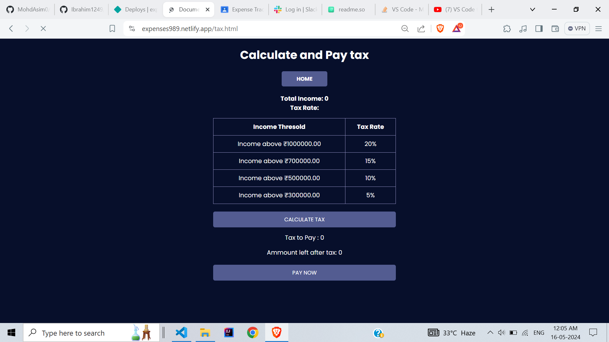

# **Expense Tracker 😍**
## [hosted Link](https://expenses989.netlify.app/)

# task
* Track and categorize expenses easily andSet budgets
* Utilize Chart.js for intuitive and interactive data visualization.
* Implement AI-driven financial advice based on user spending patterns.
* Estimate annual taxes based on income and expenses.
* add payment integration

# 🧠Tech Stack
- HTML5
- CSS 3
- JavaScript
- Chart.js
- Google Gemini Api
- Razorpay payment integration

# Features 😇

## Sign Up and Login Page
* LocalStorage is used here to store user information
---

--- 

## Home Page

## Tax Page
